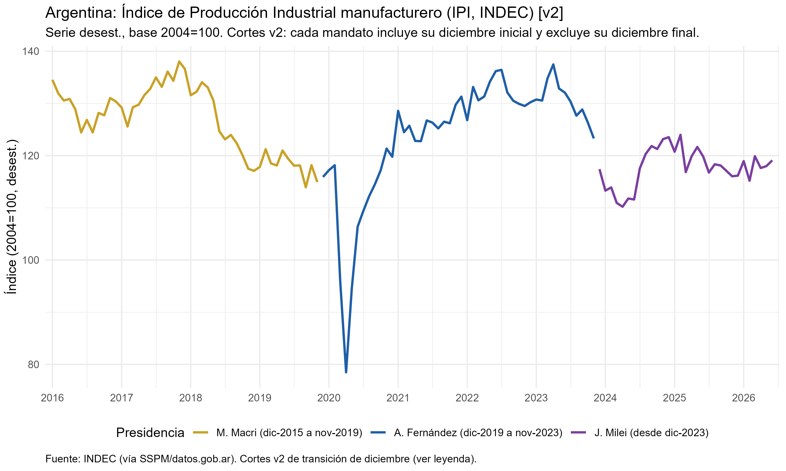
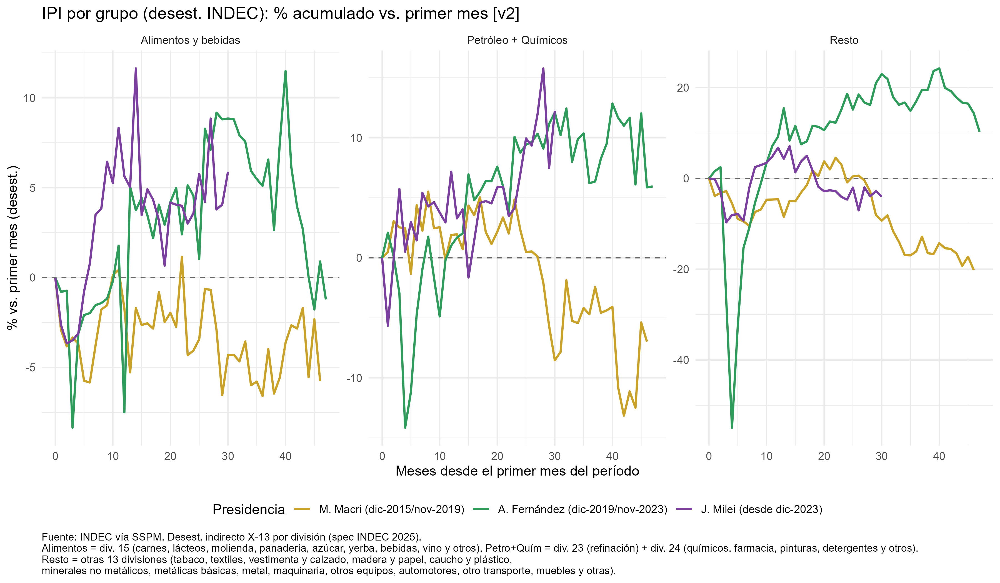
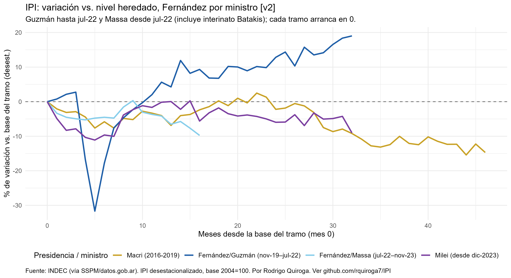
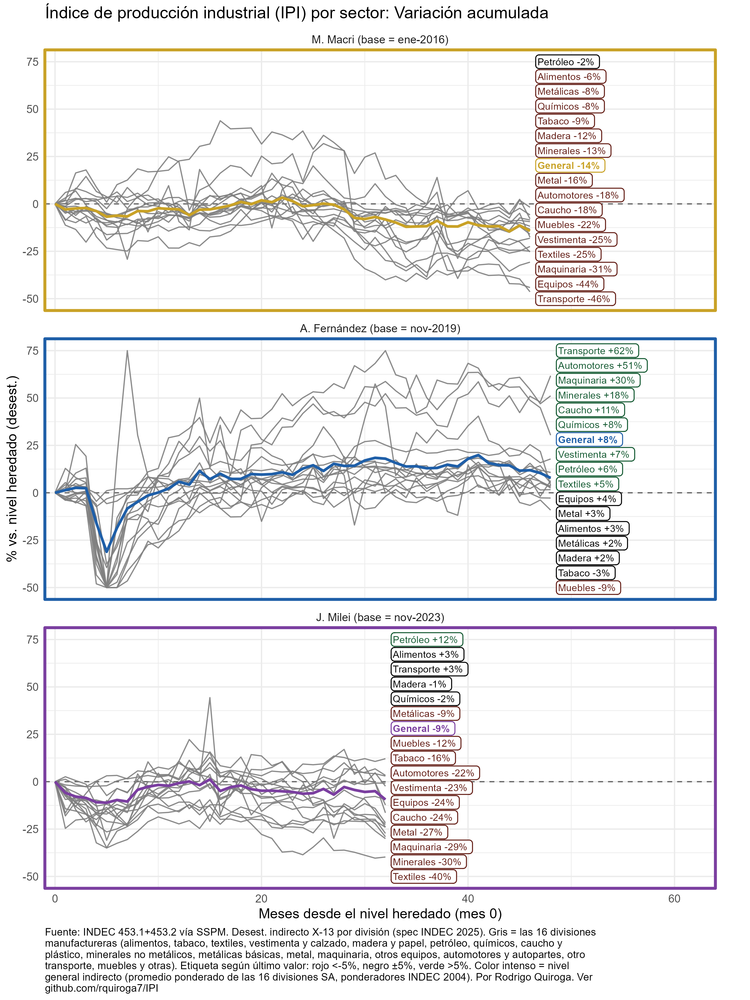

# IPI manufacturero argentino por presidencia

Por Rodrigo Quiroga. Ver [github.com/rquiroga7/IPI](https://github.com/rquiroga7/IPI).

Este repo sigue la evolución de la industria manufacturera argentina (IPI del INDEC) según quién gobernaba, con gráficos y tablas que se regeneran solos cada vez que sale un dato nuevo. Último dato disponible: **julio de 2026**.

## Datos y metodología (cortito)

- **Fuente:** IPI manufacturero del INDEC, vía SSPM/datos.gob.ar. Distribución 453.1 (nivel general: serie original, desestacionalizada y tendencia-ciclo) y 453.2 (las 16 divisiones manufactureras). Base 2004=100, mensual desde enero de 2016.
- **Desestacionalizado propio (método indirecto INDEC):** en vez de ajustar el total directamente, se ajusta cada una de las 16 divisiones por separado con X-13ARIMA-SEATS usando las especificaciones que publicó INDEC en su nota metodológica 2025, y después se agregan con los ponderadores de 2004. La validación cierra: el nivel general reconstruido correlaciona 0,998 con el desestacionalizado oficial.
- **Tres grupos:** Alimentos y bebidas (peso 24,46), Petróleo + Químicos (refinación 4,17 y químicos 12,71, ponderados) y Resto (las otras 13 divisiones, como residuo del promedio ponderado).
- **Dos criterios de corte:** V1 por años calendario (2016–2019, 2020–2023, 2024–) y V2 con transición de diciembre (cada mandato incluye su diciembre inicial, reflejando las asunciones del 10 de diciembre).
- Cada presidencia se mide contra el *nivel heredado* (último mes del gobierno anterior, mes 0), no contra su propio arranque. Además, para algunos análisis hacemos un corte extra que divide la presidencia de Fernández en Guzmán (hasta jul-22) y Massa (desde jul-22).

## Cómo se actualiza

```r
Rscript download_ipi.R  # baja lo último (saltea la descarga si ya está al día)
Rscript run_all.R       # regenera CSVs, gráficos y tablas
```

## Qué muestran los datos

### El nivel general: tres películas distintas



- **Macri (dorado):** arranca en ~135, pico a fines de 2017 (~138) y caída sostenida en 2018–2019 hasta ~115. Promedio desestacionalizado del mandato: **126,6**.
- **Fernández (azul):** el pozo de la pandemia (piso ~78 en abr-20), rebote fuerte hasta 2022 (~137) y desgaste en 2023. Promedio: **124,0**.
- **Milei (violeta):** caída inicial en 2024, rebote parcial y después amesetamiento con sesgo a la baja; el último dato (jul-26, 112 desest.) es de los más flojos de su mandato. Promedio parcial: **117,5**

### Variación por grupos



El panel del Resto (las 13 divisiones que no son alimentos ni petróleo/químicos): se desploma **−20,2%** punta a punta con Macri, recupera **+10,4%** con Fernández y vuelve a caer **−19,3%** con Milei (a jul-26). En cambio Alimentos y bebidas y Petróleo + Químicos se mueven menos en los tres gobiernos (entre −7% y +8%). La industria que genera empleo manufacturero masivo es la más volátil políticamente.

### El gobierno de Fernández partido en dos: Guzmán vs. Massa



Partiendo cada tramo de cero: el tramo Guzmán (nov-19–jul-22) termina del orden de **+19%**, motorizado por el rebote post-pandemia; el tramo Massa (jul-22–nov-23) termina alrededor de **−10%**. El promedio parejo de Fernández (+10,4% en el Resto) engloba dos etapas con resultado industrial opuestos.

### La dispersión sectorial: no hay una industria, hay 16 industrias



Cada línea gris es una división (etiqueta con su valor final: rojo <−5%, negro ±5%, verde >+5%; la línea gruesa es el nivel general):

- Con **Fernández** conviven Transporte **+62%** y Automotores **+51%** con Muebles **−9%**.
- Con **Milei** (a jul-26) solo Petróleo está claramente arriba (**+12%**), mientras Textiles (**−40%**), Minerales (**−30%**) y Maquinaria (**−29%**) se hunden.
- Con **Macri** casi todo terminó en rojo, con Transporte (**−46%**) y Equipos (**−44%**) al fondo.

## Archivos del repo

- `download_ipi.R` — descarga los CSV con chequeo de ETag/md5 (no re-descarga lo ya actualizado).
- `run_all.R` — corre los 6 scripts de análisis en orden.
- `ipi_industrial.R` / `ipi_industrial_v2.R` — nivel general y variación acumulada (V1/V2).
- `ipi_grupos.R` — grupos con serie original.
- `ipi_grupos_sa.R` — grupos y sectores desestacionalizados (método indirecto INDEC), incluyendo la variante por sector con etiquetas.
- `ipi_ministros.R`, `ipi_promedios.R` — corte Guzmán/Massa y promedios por presidencia.
- `ipi-*.csv`, `ipi_*.png`, `tabla_*.md` — salidas generadas (no las edites a mano, se pisan).

## Fuentes

INDEC, IPI manufacturero, vía SSPM ([datos.gob.ar](https://datos.gob.ar)), distribuciones 453.1 y 453.2. Base 2004=100.
